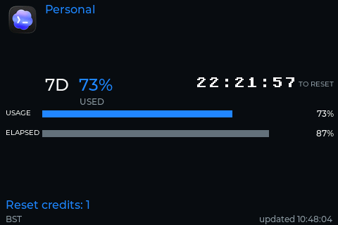
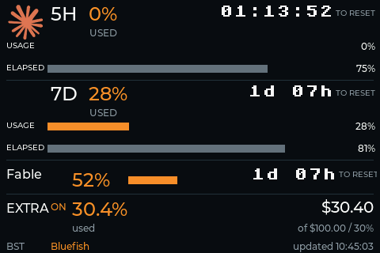

# quota-meter

Subscription quota monitoring for OpenAI Codex and Claude, with a Python CLI and a
standalone ESP32-S3 display.

## ESP32 display

The device shows quota usage and reset timers for multiple Codex and Claude
accounts. Recently active accounts rotate every 10 seconds; inactive accounts
get an occasional slot every two minutes. See the [firmware guide](firmware/README.md)
for hardware, setup, and build instructions.

Hardware: [JC3248W535EN ESP32-S3 display on AliExpress](https://www.aliexpress.com/item/1005008870532063.html).

### Screenshots

Captured directly from the device's framebuffer at 480×320, not photographed.

| Codex | Claude |
| --- | --- |
|  |  |

### Device photos

No stand needed: the device sits securely on the desk, supported by its USB cable,
as shown below.

| Front | Back |
| --- | --- |
|  |  |

## Let a coding agent set it up

Open or clone this repository in a **local coding agent with terminal and USB
access**. Only the JC3248W535EN board above is supported. Plug it in with a USB
data cable, then copy this prompt:

> Read AGENTS.md and firmware/README.md. Set up my Quota Meter end to end:
> install missing tools, compile and flash the firmware, configure Wi-Fi, and
> help me log in to Codex and Claude with fresh device-only sessions. Ask which
> providers and account labels I want. Automatically select the only compatible
> USB device; ask me to choose only if ambiguous. Preserve existing Wi-Fi and
> accounts, never erase them. Use the local Wi-Fi file or setup portal, not chat
> for secrets. Guide me through browser account selection and login, then verify
> live quotas on the display and status API. Continue without routine confirmations.

You still plug in the board and complete browser account selection, consent,
login and any 2FA. The agent cannot bypass those steps. If no compatible board is
connected, it builds the firmware and asks you to plug it in. Never paste Wi-Fi
passwords or provider tokens into chat.

### Other copy-paste prompts

Use these in the same repository; replace the example provider and account label
as needed:

- **Build only:** “Read AGENTS.md and firmware/README.md. Install missing build
  tools and compile the firmware. Report the artifact path; do not flash or change
  any device, Wi-Fi, or login.”
- **Update firmware:** “Read AGENTS.md and firmware/README.md. Build and flash the
  current checkout to my Quota Meter, preserving Wi-Fi and all accounts. Select
  the only compatible USB device automatically; ask only if ambiguous. Do not
  erase or log in again. Verify it boots and resumes quota polling.”
- **Add an account:** “Read AGENTS.md and firmware/README.md. Add a Claude account
  named Research Team to my display using a fresh device-only login. Have me
  confirm the browser account. Preserve other accounts and verify new quotas.”
- **Renew an account:** “Read AGENTS.md and firmware/README.md. Renew the Codex
  account named Personal using a fresh device-only login and the exact same
  provider/name. Preserve other accounts and verify new quotas.”
- **Desktop only:** “Read AGENTS.md and README.md. Set up the desktop CLI, guide me
  through `quota-meter login all`, then show my quotas. Do not flash or configure
  a device, or reuse a device-owned session.”
- **Diagnose:** “Read AGENTS.md and firmware/README.md. Diagnose why my display
  has no fresh quotas using non-secret status. Check USB, Wi-Fi, time and provider
  polling/backoff. Do not erase, clear accounts or log in again unless needed and
  I explicitly request it. Explain what you verified and what remains blocked.”

Account labels are local names, not proof of which browser account was used.
Adding the same provider/name replaces that account; use a new name to add another.
For manual hardware setup, see the [firmware guide](firmware/README.md).

## Desktop CLI

### Prerequisites

- [`uv`](https://docs.astral.sh/uv/getting-started/installation/)
- Python 3.11 or newer
- [`codex`](https://developers.openai.com/codex/cli/) on `PATH` for OpenAI
- [`claude`](https://code.claude.com/docs/en/overview) on `PATH` for Claude
- A Unix-like platform for Claude's PTY-based interactive login

Install the project with `uv sync`, then run:

```console
uv run quota-meter login openai
uv run quota-meter login claude
uv run quota-meter login all
uv run quota-meter quotas openai
uv run quota-meter quotas claude
uv run quota-meter quotas all
uv run quota-meter quotas all --json
```

OpenAI login launches `codex app-server`, requests Codex's ChatGPT device-code login,
and displays the verification URL as a terminal QR alongside its user code. Codex owns
all credential storage and refresh behavior. Quota reads likewise use the app-server's
account and rate-limit methods rather than reading Codex tokens.

Claude has **no device authorization grant**. Its login is explicitly a QR-assisted
OAuth authorization-code flow with PKCE and a possible manually pasted code. The tool
runs the official `claude auth login --claudeai` inside a Unix PTY, relays the terminal,
and adds a QR for the authorization URL; Claude Code still owns the login itself.
Unsupported platforms receive guidance to run the official command directly.

For Claude quota reads, the tool only reads Claude Code's official OAuth credential
location: macOS Keychain service `Claude Code-credentials`, or
`${CLAUDE_CONFIG_DIR:-~/.claude}/.credentials.json` elsewhere. It never prints or writes
tokens and asks for a new login when the access token has expired. It then calls
`https://api.anthropic.com/api/oauth/usage`. **Anthropic does not document this usage
endpoint or promise its stability**, so this integration may break when Claude Code
changes. The CLI distinguishes authentication, authorization, and throttling errors.

`--json` emits the complete provider response rather than the human-oriented summary.
Avoid sharing JSON output because account or provider payloads may contain metadata.
